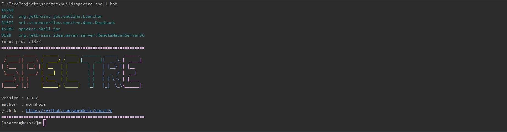
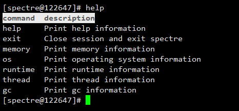
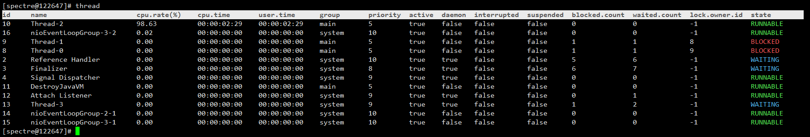
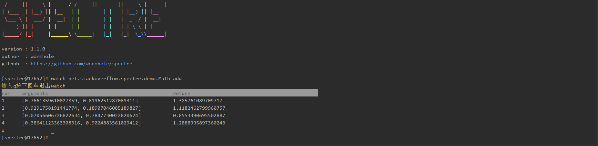
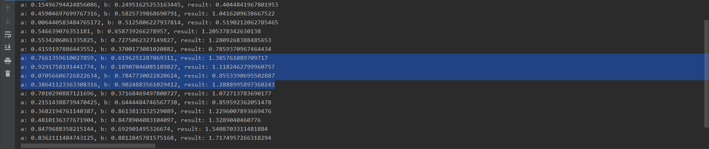
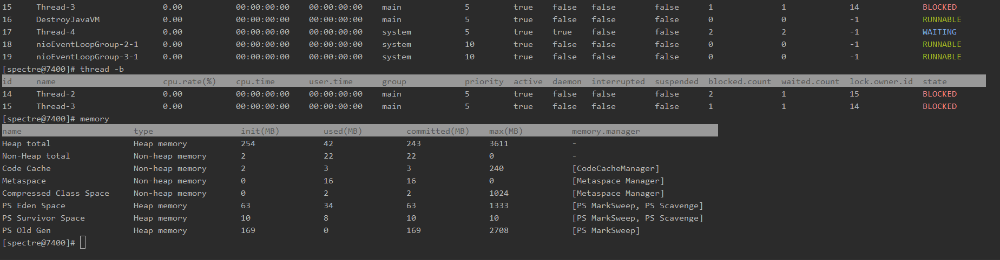
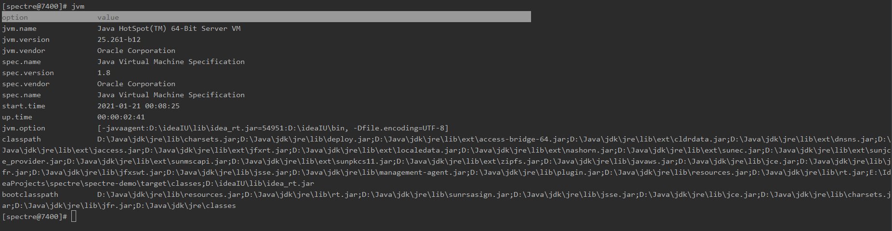
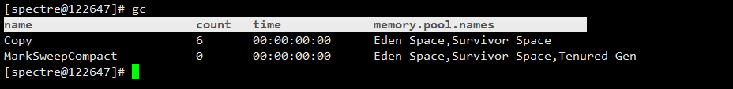
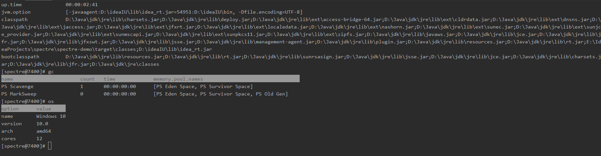

[](https://github.com/wormhole/spectre/releases)
[](https://www.travis-ci.org/wormhole/spectre)
[](https://github.com/wormhole/spectre/blob/master/LICENSE)
[](https://github.com/wormhole/spectre/archive/master.zip)
[](https://github.com/wormhole/spectre/releases)
[](https://github.com/wormhole/spectre/network/members)
[](https://github.com/wormhole/spectre/stargazers)

## 一、简介
这是一款`JVM`监控、调优工具。你可以认为它是一款低配版的`arthas`，反正`spectre`有的功能，`arthas`都有，`spectre`没有的功能，`arthas`也有。

## 二、构建
* 准备`jdk`和`maven`

* 下载源码
```
git clone https://github.com/wormhole/spectre.git
```

* 执行构建脚本
```
# bash build.sh 或 build.bat
```

* 目录`build`内的为构建好的程序

## 三、使用
* 下载最新版本  
 [👉点击此链接下载最新版本](https://github.com/wormhole/spectre/releases/download/v1.1.0/spectre-1.1.0.tar.gz)
 
* 运行启动脚本  
```
# ./spectre-shell.sh 或 spectre-shell.bat
```

* 根据提示输入你需要`attach`的`jvm`进程`id`，显示`logo`说明已经`attach`到`jvm`进程上  


* `help`命令：查看更多所支持的命令及其介绍  


* `thread`命令：查看`jvm`线程信息，添加参数`-b`可以过滤出死锁线程，添加参数`-w`可以过滤出等待状态线程  


* `watch`命令：监控方法的输入参数与返回值，命令格式`watch -t className methodName`
* 这里准备了一段示例代码
```
package net.stackoverflow.spectre.demo;

import java.util.Random;

public class Math {

    public Double add(Double a, Double b) {
        return a + b;
    }

    public Double sub(Double a, Double b) {
        return a - b;
    }

    public static void main(String[] args) {
        Math math = new Math();
        while (true) {
            Random random = new Random();
            Double a = random.nextDouble();
            Double b = random.nextDouble();
            System.out.println("a: " + a + ", b: " + b + ", result: " + math.add(a, b));
            try {
                Thread.sleep(5000);
            } catch (InterruptedException e) {
                e.printStackTrace();
            }
        }
    }
}
```
* 我们为了监控`add`方法输入以下命令`watch -t net.stackoverflow.spectre.demo.Math add`，并查看输出

* 对照程序的输出验证


* `memory`命令：查看`jvm`内存信息，包括堆内存，非堆内存等，以及各自使用的垃圾收集器和收集算法  


* `jvm`命令：查看`jvm`信息，包括虚拟机的名称版本，标准的名称和版本，类路径，`jvm`参数等  


* `gc`命令：查看垃圾收集器信息  


* `os`命令：查看操作系统信息  


* `exit`命令：退出`spectre shell`

## 三、LICENSE
SPECTRE software is licenced under the [MIT](LICENSE) License