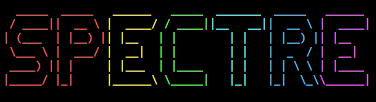
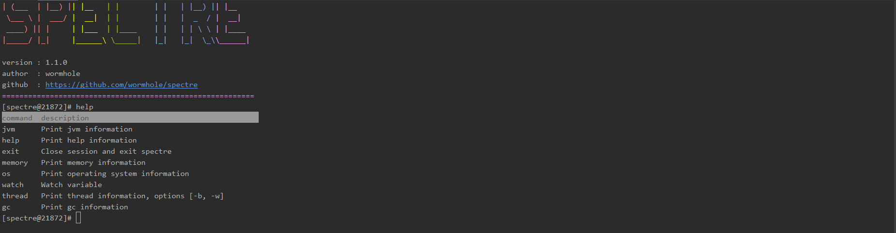

[](https://github.com/wormhole/spectre/releases)
[](https://www.travis-ci.org/wormhole/spectre)
[](https://github.com/wormhole/spectre/blob/master/LICENSE)
[](https://github.com/wormhole/spectre/archive/master.zip)
[](https://github.com/wormhole/spectre/releases)
[](https://github.com/wormhole/spectre/network/members)
[](https://github.com/wormhole/spectre/stargazers)

## 一、简介
这是一款`JVM`监控、调优工具（暂时可能只有监控功能吧，哈哈🙃）。你可以认为它是一款低配版的`arthas`，反正`spectre`有的功能，`arthas`都有，`spectre`没有的功能，`arthas`也有。它为什么叫`spectre`呢？
名字来源于`dota2`中我最喜欢的一个英雄幽鬼👻，她有全刀塔最强最无解的切入技能`降临`，我希望这款工具也能够拥有此能力，切入到`JVM`的各个角落⚔。

## 二、使用
* 下载最新版本  
 [👉点击此链接下载最新版本](https://github.com/wormhole/spectre/releases/download/v1.0.0/spectre-1.0.0.tar.gz)
 
* 运行启动脚本  
```
# ./spectre-shell.sh 或 spectre-shell.bat
```

* 根据提示输入你需要`attach`的`jvm`进程`id`，显示`logo`说明已经`attach`到`jvm`进程上  


* 输入`thread`命令查看`jvm`线程信息，如图所示，我们很容易看出死锁的线程  


* 输入`memory`命令查看`jvm`内存信息，包括堆内存，非堆内存等，以及各自使用的垃圾收集器和收集算法  


* 输入`runtime`查看`jvm`运行时信息，包括虚拟机的名称版本，标准的名称和版本，类路径，程序输入参数等  


* 输入`gc`查看垃圾收集器信息  


* 输入`os`命令，查看操作系统信息  


* 输出`help`查看更多所支持的命令及其介绍  


## 三、LICENSE
SPECTRE software is licenced under the [MIT](LICENSE) License